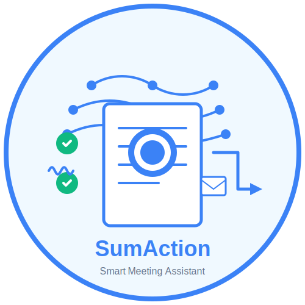

# Meeting-Bot

<h1 align = "center" > SumAction </h1>
<h3 align = "center" > Plan your week and get ahead of everyone! </h3>
<p align = "center" >
    
    </p>

## Executive Summary  

The **SumAction** AI Productivity tool analyzes your uploaded meeting notes (formats supported: text, video, audio) and uses AI to deliver a concise summary of the meetings, key learnings, along with a list of action items and a estimate of the task. The tool allows you to increase your productivity by taking care of the menial tasks of emailing attendees their specific tasks, giving you the opportunity to be more productive or just a rest from the daily rigmarole.

We leveraged OpenAI, its LLMs, and engineered prompts that were effective in creating our productivity tool to summarize uploaded meeting notes (Audio, Video, Text) and to extract action items.  

## Table of Contents  

- [Project Overview](#project-overview)  
  - [Project Requirements](#project-requirements)  
  - [Data Collection](#data-collection)  
  - [Data Analysis](#data-analysis)
  - [Identify Correlation](#identify-correlation)
- [Findings](#conclusion)
  - [Statistical Significance](#statistical-significance)
  - [Lessons Learned](#lessons-learned)
  - [Next Steps](#next-steps)  
- [Data Sources](#data-sources) 
- [Team Mambers](#team-members)
- [Presentation](#presentation)

## Project Overview  
We Americans love our meetings! We often find ourselves spending a significant portion of our waking hours in back-to-back meetings. Research indicates that professionals spend an average of 20-25 hours every week in meetings. Furthermore, individuals spend an additional 30-45 minutes on post-meeting activities, including compiling notes, action items, and follow-up tasks. This becomes even more challenging in today's fast-paced work environment, where many of us transition seamlessly from one meeting to the next. The constant context switching and information overload can lead to decreased productivity, increased stress, and a struggle to effectively manage workloads.

Our team is developing an innovative solution that leverages the power of Large Language Models (LLMs) and intelligent bots to dramatically increase meeting productivity. We aim to address these challenges by creating a suite of tools that automate critical meeting-related tasks, allowing professionals to focus on higher-value activities. 

Our solution offers the following key features:
1. **Automated Summarization:** Our bot automatically generates concise and accurate summaries of meeting discussions, capturing key points and decisions. This eliminates the need for manual note-taking and ensures that all participants have a clear record of what was discussed.

1. **Action Item Tracking and Assignment:** The bot intelligently identifies and extracts action items from meeting conversations, automatically assigning them to responsible parties. This ensures clear accountability and prevents action items from falling through the cracks.

1. **Automated Distribution:** Summarized notes and assigned action items are automatically distributed via email to relevant participants, streamlining communication and ensuring that everyone stays informed.

1. **Action Item Effort Estimation: (Key Differentiator)** Unlike existing solutions, our bot goes beyond simple action item tracking. It leverages LLMs to provide effort estimates for assigned action items. This unique feature enables users to:

    1. ***Improve Project Planning:*** Accurately estimate the time required for each task, facilitating more effective project planning and resource allocation.

    1. ***Optimize Scheduling:*** Better manage individual workloads and schedules by understanding the effort involved in completing assigned tasks.

    1. ***Proactively Manage Delays:*** Identify potential bottlenecks or scheduling conflicts early on, allowing for proactive mitigation and ensuring timely deliverable completion.

1. **Aggregated Action Item Management: (Key Differentiator)** Our solution also gathers and consolidates all action items assigned to individual users across all their meetings within a given day. This provides a comprehensive overview of daily responsibilities, enabling users to:

    1. ***Prioritize Tasks Effectively:*** Gain a holistic view of their workload, allowing them to prioritize tasks based on urgency and importance.

    1. ***Optimize Daily Workflow:*** Plan their workday more efficiently by understanding the full scope of their commitments.

    1. ***Enhance Time Management:*** Proactively manage their time and avoid feeling overwhelmed by fragmented action items spread across multiple meetings.

1. **Contextual Query Bot:** We have also developed a query bot that allows users to quickly retrieve specific information from past meetings. This bot enhances recall and facilitates efficient context gathering, enabling users to:

    1. ***Quickly Find Information:*** Avoid spending valuable time searching through lengthy meeting transcripts or notes.

    1. ***Improve Decision Making:*** Access relevant historical information to make more informed decisions.

    1. ***Onboard New Team Members:*** Quickly bring new team members up to speed by providing them with easy access to past meeting discussions.


By automating these time-consuming and often tedious tasks, our AI-powered meeting bot empowers professionals to reclaim valuable time, reduce stress, and focus on the substantive aspects of their work.

## Project Requirements
Please review the 'requirements.txt' file in the Resources folder to get a complete overview of the entire set of libraries that are needed to run the program.
Use the single line to run the command within the Jyupter Notebook | [!pip install -r requirements.txt. ]
- **Software Requirements:**
  - [Python 3.12.9 or greater](https://www.python.org/)   
  - [Jupyter Notebook](https://jupyter.org/)
  - GitHub account   
  - Load Dependancies: 
    ```
    from langchain_openai import ChatOpenAI
    from dotenv import load_dotenv
    import os
    from langchain.agents import initialize_agent, load_tools
    from langchain.chains.llm import LLMChain
    from langchain_core.prompts import ChatPromptTemplate
    from langchain.docstore.document import Document
    from langchain.chains.summarize import load_summarize_chain
    from langchain_core.prompts import PromptTemplate
    import pandas as pd
    from datasets import load_dataset
    from openai import OpenAI
    from rouge import Rouge
    from rouge_score import rouge_scorer
    from pprint import pprint
    import nltk
    import evaluate
    import tiktoken
    from transformers import pipeline
    import matplotlib.pyplot as plt
    ```
- **GitHub Repository Structure:**
``` Markdown for Clean display of GitHub Repository Structure
  📦Meeting-Bot 
      ┣ 📂Nik_folder  (Project Notebooks: Summarizer, Action Extractor, Email Developer / Collector and MailAgent)
      ┣ 📂Zain_folder (Project Notebooks: Summarizer, Action Extractor, Evaluator, TaskEstimateBot, Q&A Query)
      ┣ 📂Resources (Meeting recordings, CommonTasks.csv) 
      ┣ 📜.utils.py
      ┣ 📜.gitignore
      ┣ 📜LICENSE 
      ┣ 📜README.md 
      ┗ 📜SumAction.svg
```
- **For Project Files, see:**
    - /Zain/Zain_meeting_ai_workspace.ipynb
    - /Nik/meeting_ai_workspace.ipynb

  
## Data Collection 
- (Also See [Data Sources](#data-sources))  
1. Public Meetings:  
    - Initial assessment conducted to understand the data and identify any issues
        - Read in each year from 2013-2024 and convert to a new DataFrame
        - Combined into Moon Phase DataFrame to be used for analysis 
        
      
2. Zain's Meeting Notes:
    - Initial assess


## Data Analysis
- GOAL: Determine if there is a statistically significant correlation between moon phases and crime rates in sampled metropolitan areas (Chicago, Houston, Austin, Denver, Los Angeles, and Traffic in Baltimore)).
- Identify any specific crime types that may be more strongly influenced by the lunar cycle. Explore potential explanations for any observed correlations (e.g., increased visibility during full moon).

- Aggregation Example:  

- Comparison:  


## Visualizations  

- Plot of Los Angeles Crime Data by Day,
  Sliced data for 2020-2024


- Full Moon Normalized


- Full Moon Traffic Normalized


- Outlier Crime Data


## Identify Correlation
No obvious statistical pattern identified.  Mean, Ratios, Statistical, Confidence Interval analyses all indicate a LOW to NO relationship between Erratic Behaviors (Crime & Traffic incidents) and Moon Phases.  Null Hypothesis proved:
Full Moon Crimes / Divided by / Other Moon Phase Crime rates found distinct tendencies towards ‘1.0.’  This indicates there is a LOW correlation in four of the five city/Moon phase datasets (and in the traffic/Moon phase dataset). Permutation tests indicate a 33% chance of erratic incidents when Moon phases are compared.
 


## Findings 
Outside of Denver, CO crime data displayed a hint of a relation (still not strong enough), the majority of our data results proved our H0, or Null, Hypothesis to be proven, i.e. NO RELATIONSHIP EXISTs between Full Moon and Erratic behavior. 
Multiple realtionship measurements were applied (Mean, Ratios, Statistical Significance, CI, P-value) across the dataset and each confirmed Full Moon days are just like any other moon days and do NOT dramatically influence or cause erratic behavior.  In this investigation, there was no significant correlation between in crime or automobile traffic incidents.

While at the higher level the Null Hypothesis proved, our disappointment was used as fuel to investigate deeper to see if any micro-influeces (eg. Type of Crime) were present. This is where we found it quite interesting to see that Murder Rate in Denver, CO was a little bit higher (2% increase) on Full Moon days vs. Other moon days.  Another interesting trend was a marked increase in Tresspassing violations during Full moon phases. 

## Lessons Learned
Obtaining Data that is accurate and reliable early on is important.  Authoratative public data can hold interesting patterns.  Data can have irregularities and data needs to be normalized.  Different types of statistical analyses, graphing and plotting reveal interesting patterns within the data.  Processing data files takes time and diligence to normalize as there are time zone, UTC and formatting issues to overcome.  Communicatiing roles and responsibilities with expected deliverable dates will help on future projects to best utilize resources.  Version control and using github can be a challenge; the .DSstore file from the Apple IOS proved to be problematic and 'dot ignore' file is mandatory at this level of programming.  

**Cost Of Project**
Using the following average Colorado salary scales for team member roles, we were able to calculate the cost of conducting this project. 
- Data Scientist (1): $104,771 | *(per week cost = $2014.82)*
- Data Engineer (2): $117,223 | *(per week cost = $2254.29)*
- Project Manager (1): $93,823 | *(per week cost = $1804.29)* 

Total Internal Cost for Conducting Analysis (2 weeks) = $16,655.38 

Having proven that there isn't a relationship that exists between Full Moons and Erratic Beahvior *(Crime/Traffic Violations)*, we hope to reach out to the **6000** 911 call centers, also known as Public Safety Answering Points [PSAs](https://health.wusf.usf.edu/health-news-florida/2024-07-18/the-nations-911-system-is-on-the-brink-of-its-own-emergency) that may be prone to overstaffing their call centers with additional resources to handle a percieved increase in erratic behavior, especially surrounding full moon days *(3 days: 1 day prior, day of full moon, 1 day after)* that are still percieved by many to be a full moon. 

**Tax Payer Savings**
Assume we save the need to overstaff just by a single dispatcher across the 3 days of percieved full moons *(3 days: 1 day prior, day of full moon, 1 day after)*  
- Average call center dispatcher makes [$18/hour](https://www.ziprecruiter.com/Salaries/Customer-Service-Dispatcher-Salary). 
    - We'd save tax payers around *~$486/person* for a single dispatcher working over the 3 days they plan to overstaff to handle the alledge additional call volume. 
- There are roughly **6000** [911 call Centers](https://health.wusf.usf.edu/health-news-florida/2024-07-18/the-nations-911-system-is-on-the-brink-of-its-own-emergency) in the US.
- 36 Alleged Full Moon days (12 actual Full Moons in a year. +/- 1 day surrounding the full moon)
- Savings of even 1 staff member across 36 Full Moon Days in a Year across 6000 PSAs could save the tax payers =  *$34,992,000*     *(12 x $486 x 6000 locations)*
  

## Next Steps:
If a organization, public or private, are willing to sponsor and provide authoratative raw data on local crime, traffic, 911, Emergency rooms and other first responder data, the Lunar Madness Team ("LM") could be contracted to combine the data and further refine this proof of concept template.  The LM framework includes moon phase data, and has several models to plug in local and regional data to uncover statistical correlations.  The Lunar Madness team will scour the data for high correlation events such as crime with other local events or phenomena, research is not limited to just moon phase data.  Set our team to the task of investigating revenue patterns, custom projects, or explore for unidentified trends.  Correlated information that leads to efficient management and can be predicted can make the difference between success vs. surviving.  Let us know the problem you wish to solve and we will do the analysys and presentation for you and your organization.

## Appendix
## Data Sources:
### Full Moon Data Sources:
- [National Weather Service](https://www.weather.gov/box/sunmoon)
 (National Oceanic and Atmospheric Administration)  
Data Points:  Daily moon phase information (e.g., new moon, full moon, first quarter, last quarter, percentage of illumination)  

- [US Naval Observatory Moon Phases](https://aa.usno.navy.mil/calculated/moon/phases?date=2024-01-10&nump=50&format=t&submit=Get+Data)  
Data Points:  Daily moon phase information (e.g., new moon, full moon, first quarter, last quarter)   

### Crime Data Sources:
- [US Government provided data](https://catalog.data.gov/dataset/?tags=crime)  
Data Points: Date and time of each reported crime incident, Crime type  

- [Los Angeles Crime Data](https://data.lacity.org/Public-Safety/Crime-Data-from-2020-to-Present/2nrs-mtv8/about_data)  
Data Points: Date and time of each reported crime incident, Crime type | 1004683 rows of data

- [Houston Crime Data](https://www.kaggle.com/datasets/iamkevin/raw-aggregate-houston-crime-report-data)  
Data Points: Date and time of each reported crime incident, Crime type | 1185476 rows of data 

- [Denver Crime Data](https://www.kaggle.com/code/paulo098/denver-crime-data-analysis-and-prediction)  
Data Points: Date and time of each reported crime incident, Crime type | 386867 rows of data 

- [Austin Crime Data](https://catalog.data.gov/dataset/crime-reports-bf2b7)  
Data Points: Date and time of each reported crime incident, Crime type | 2522587 rows of data

### Traffic Data Source
- [Maryland Traffic Data](https://data.montgomerycountymd.gov/Public-Safety/Traffic-Violations/4mse-ku6q/about_data)
Data Points: Date and time of each reported traffic violation, Violation type | 1048608 rows of data

## Team Members:  
Data Engineer: Sheila Mathews  
Data Analyst: Raymond Stover  
Data Scientist: Michael Brady  
Data Scientist: Zain Master  
